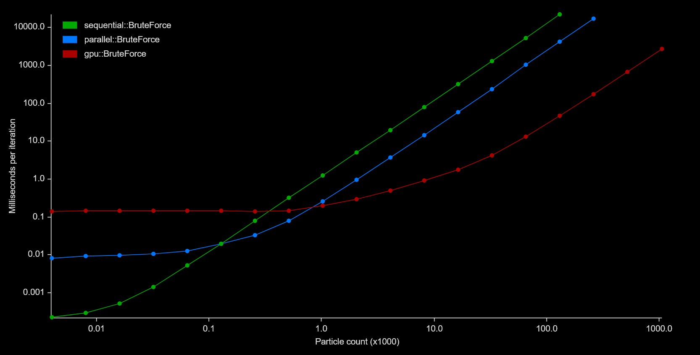

# Particular

<div align="center">
  
</div>

[](https://github.com/canleskis/particular#license)
[](https://crates.io/crates/particular)
[](https://docs.rs/particular)

Particular is a crate providing a simple way to simulate N-body gravitational interaction of particles in Rust.

## Goals

The main goal of this crate is to provide users with a simple API to setup N-body gravitational simulations that can easily be integrated into existing game and physics engines.
Thus it does not include numerical integration or other similar tools and instead only focuses on the acceleration calculations.

Currently, provided `ComputeMethods` are naive and iterate over the particles and sum the acceleration caused by the `massive` particles.
I will likely provide algorithms such as e.g. [Barnes-Hut](https://en.wikipedia.org/wiki/Barnes%E2%80%93Hut_simulation) in the future.

Particular can be used with a parallel implementation on the CPU thanks to [rayon](https://github.com/rayon-rs/rayon). Enable the "parallel" feature to access the available compute methods.

Particular can also be used on the GPU thanks to [wgpu](https://github.com/gfx-rs/wgpu). Enable the "gpu" feature to access the available compute methods.

## Using Particular

### Implementing the `Particle` trait

#### Deriving

Used in most cases, when the type has fields named `position` and `mu`:

```rust
#[derive(Particle)]
struct Body {
    position: Vec3,
    mu: f32,
//  ...
}
```

#### Manual implementation

Used when the type has more complex fields and cannot directly provide a position and a gravitational parameter.

```rust
struct Body {
    position: Vec3,
    mass: f32,
//  ...
}

impl Particle for Body {
    type Scalar = f32;
    type Vector = Vec3;

    fn position(&self) -> Vec3 {
        self.position
    }
    
    fn mu(&self) -> f32 {
        self.mass * G
    }
}
```

### Setting up the simulation

Using the type implementing `Particle`, create a `ParticleSet` that will contain the particles.

Particles are stored in two vectors, `massive` or `massless`, depending on if they have mass or not.
This allows optimizations for objects that are affected by gravitational bodies but don't affect them back, e.g. a spaceship.

```rust
let mut particle_set = ParticleSet::new();
particle_set.add(Body { position, mu });
```

### Computing and using the gravitational acceleration

Finally, use the `result` or `result_mut` method of `ParticleSet`.
It returns an iterator over a (mutable) reference to a `Particle` and its computed gravitational acceleration using the provided `ComputeMethod`.

```rust
let cm = &mut sequential::BruteForce;

for (acceleration, particle) in particle_set.result_mut(cm) {
    particle.velocity += acceleration * DT;
    particle.position += particle.velocity * DT;
}
```

## Notes on performance

Particular is built with performance in mind and uses multiple ways of computing the acceleration between particles in the form of `ComputeMethods`.

Here is a comparison of the three current available compute methods on an i9 9900KF and an RTX 3080:

<div align="center">
    
</div>

Above 500 particles the parallel implementation is about 5x faster than the sequential one, whilst the GPU implementation ranges from 50x to 100x faster than the parallel implementation above 15,000 particles (250x to 500x faster than sequential).

Depending on your needs, you may opt for one compute method or another. You can also implement the trait on your own type to combine multiple compute methods and switch between them depending on certain conditions (e.g. the particle count).

## Contribution

PRs are welcome!
